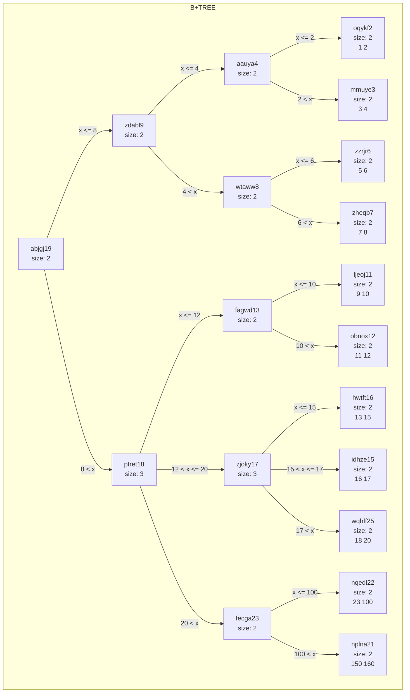
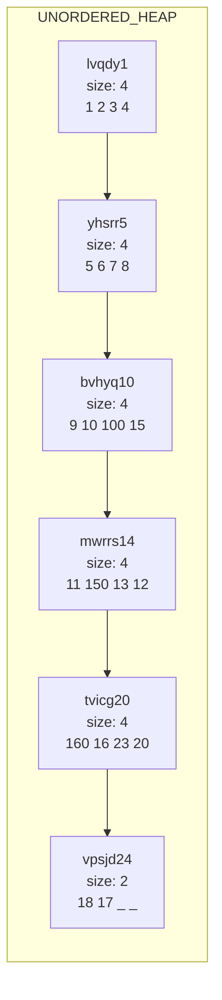

```mermaid
graph TD
subgraph B+TREE
abjgj19[abjgj19<br/>size: 2<br/>]
zdabl9[zdabl9<br/>size: 2<br/>]
aauya4[aauya4<br/>size: 2<br/>]
oqykf2[oqykf2<br/>size: 2<br/>1 2 ]
aauya4-->|x <= 2|oqykf2
mmuye3[mmuye3<br/>size: 2<br/>3 4 ]
aauya4-->|2 < x|mmuye3
zdabl9-->|x <= 4|aauya4
wtaww8[wtaww8<br/>size: 2<br/>]
zzrjr6[zzrjr6<br/>size: 2<br/>5 6 ]
wtaww8-->|x <= 6|zzrjr6
zheqb7[zheqb7<br/>size: 2<br/>7 8 ]
wtaww8-->|6 < x|zheqb7
zdabl9-->|4 < x|wtaww8
abjgj19-->|x <= 8|zdabl9
ptret18[ptret18<br/>size: 3<br/>]
fagwd13[fagwd13<br/>size: 2<br/>]
ljeoj11[ljeoj11<br/>size: 2<br/>9 10 ]
fagwd13-->|x <= 10|ljeoj11
obnox12[obnox12<br/>size: 2<br/>11 12 ]
fagwd13-->|10 < x|obnox12
ptret18-->|x <= 12|fagwd13
zjoky17[zjoky17<br/>size: 3<br/>]
hwtft16[hwtft16<br/>size: 2<br/>13 15 ]
zjoky17-->|x <= 15|hwtft16
idhze15[idhze15<br/>size: 2<br/>16 17 ]
zjoky17-->|15 < x <= 17|idhze15
wqhff25[wqhff25<br/>size: 2<br/>18 20 ]
zjoky17-->|17 < x|wqhff25
ptret18-->|12 < x <= 20|zjoky17
fecga23[fecga23<br/>size: 2<br/>]
nqedl22[nqedl22<br/>size: 2<br/>23 100 ]
fecga23-->|x <= 100|nqedl22
nplna21[nplna21<br/>size: 2<br/>150 160 ]
fecga23-->|100 < x|nplna21
ptret18-->|20 < x|fecga23
abjgj19-->|8 < x|ptret18
end
```

```mermaid
graph LR
subgraph UNORDERED_HEAP
lvqdy1[lvqdy1<br/>size: 4<br/>1 2 3 4 ]
yhsrr5[yhsrr5<br/>size: 4<br/>5 6 7 8 ]
lvqdy1-->yhsrr5
bvhyq10[bvhyq10<br/>size: 4<br/>9 10 100 15 ]
yhsrr5-->bvhyq10
mwrrs14[mwrrs14<br/>size: 4<br/>11 150 13 12 ]
bvhyq10-->mwrrs14
tvicg20[tvicg20<br/>size: 4<br/>160 16 23 20 ]
mwrrs14-->tvicg20
vpsjd24[vpsjd24<br/>size: 2<br/>18 17 _ _ ]
tvicg20-->vpsjd24
end
```
